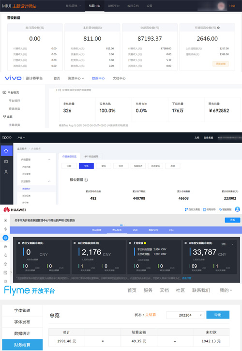

# 手写字体如何赚钱

```
本教程由做字体网（www.zuoziti.com）友情提供！
本教程是制作手写字体系列教程，建议从序言部分开始阅读学习！如需交流，请加QQ924268440
```

------

> ### **本节视频教程**

<iframe width="600" height="400" frameborder="0" src="https://www.ixigua.com/iframe/7159846939763147267?autoplay=0" referrerpolicy="unsafe-url" allowfullscreen></iframe>

> ### **手写字体也可以赚钱？**

　　是的，你没有看错，收入可看本文末收入截图。你之所以感到惊讶是因为你不了解这个行业。字体行业是小众行业，全国做字体的企业屈指可数。正是因为它是小众行业，了解的人还不多，它现在还是一片蓝海，现在进入还不算晚。

> ### **手写字体赚钱的途径**

- **手机主题代售** 比如华为、小米、OPPO、VIVO等手机主题商店都有销售手写字体。别看一款字体主题6元、3元的不起眼，但是这些手机平台依托庞大的手机用户群，自带超大流量，跟他们合作几乎是躺赚。你一定听说过这句话，“**站在风口上，猪也能起飞！**”
- **字体代售网站** 国内比较出名的比如字客网、找字网、字体超市等等的都可以帮助我们销售手写字体。平面设计师、视频工作者是会经常光顾这类网站从上面购买心仪的字体的。
- **企业授权** 你的字体有特色受欢迎了，自然就有企业主动找你谈合作谈授权了，企业平面画、宣传片上的字体都是要获得著作权所有人授权才可以进行广告的。这时候你就可以坐地起价，狠狠地赚一笔。未获得授权的使用行为是侵权的。如果你发现了别人未经你授权使用了你的字体，那你可以去告他的。
- **转让版权** 如果自己没有能力销售手写字体，还可以跟其他字库公司合作转让自己的版权给他们，或者跟他们合作分成，这样也可以赚些钱。

> ### **无图无真相，拿出小板凳坐好**

　　下面是我徒弟工作室这几年的营收情况，看到了吧，羡慕嫉妒恨啊！可惜我只是停留在技术研究层面却不具备转化生产力的能力。想到这里我已经泪流满面了！正如别人的一个段子，“看到别人赚钱，我的心里感觉比亏钱还难受！”  
