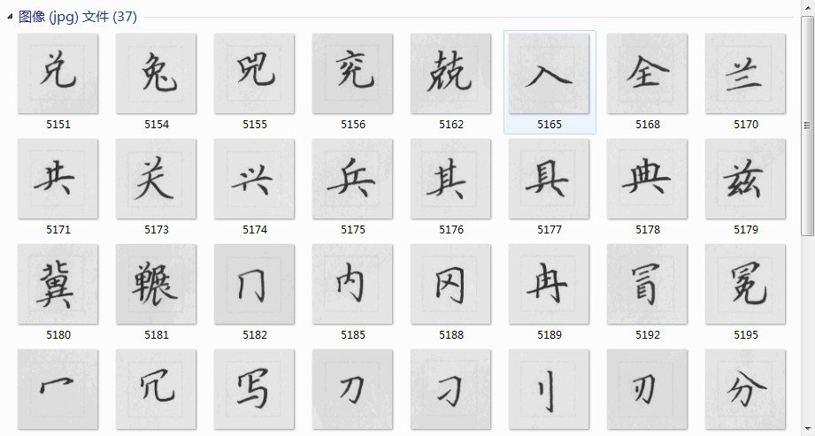
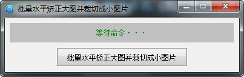
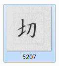
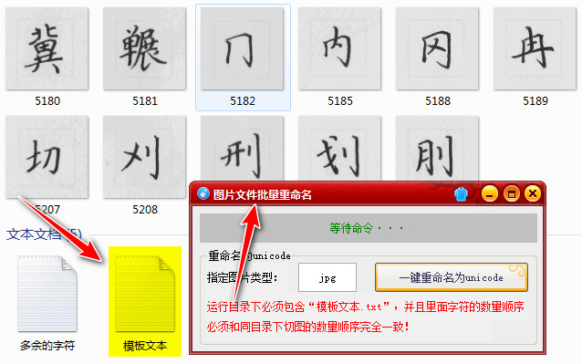
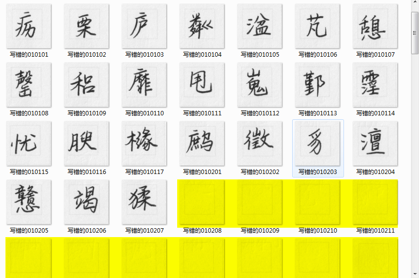
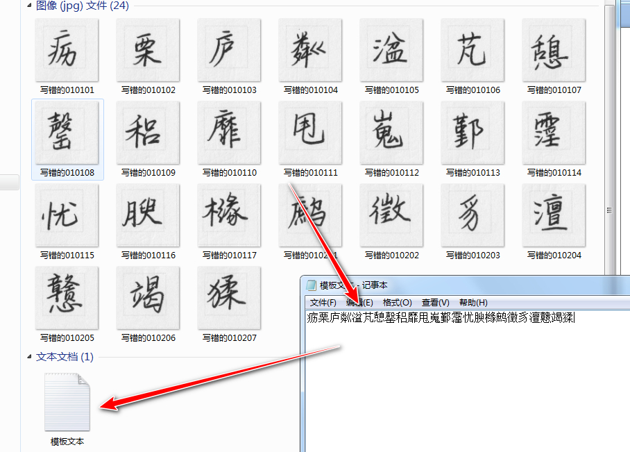
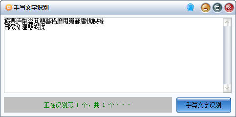

# 切图并重命名为UNICODE

```
本教程由做字体网（www.zuoziti.com）友情提供！
本教程是制作手写字体系列教程，建议从序言部分开始阅读学习！如需交流，请加QQ924268440
```

------

> ### **本节视频教程**

<iframe width="600" height="400" frameborder="0" src="https://www.ixigua.com/iframe/7159849208063885824?autoplay=0" referrerpolicy="unsafe-url" allowfullscreen></iframe>

> ### **把手写字稿切割成一个个小图**

　　上一节我们已经把手写字稿扫描好了，下面我们需要把扫描图片再切割为一个个小图。  
  
　　如上图所示，我们需要的就是这些小图片，我这边已经重命名好了，后文会介绍怎么重命名。如果你会用PS或者用其他小工具可以快速切图那最好不过了。提醒一下，在切图之前你需要先把扫描图片水平矫正了，切图要求精度很高，一旦扫描图片倾斜了切割出来的小图片就会有其他干扰的痕迹，后面导入生成字体的时候会被识别成字形的一部分，做好字体了再去修改就比较麻烦了。所以每一步我们都要求精细化。我是根据需要自己开发的**批量水平矫正大图并裁切成小图片**，如下图所示。    
  
　　别看界面简陋，但是它功能强大。借助百度AI可以实现一键水平矫正并切图，完全是自动化实现。51张扫描图片本来手工需要一个小时才处理好的，我的小软件可以在几分钟之内做好。  

> ### **一键重命名为UNICODE**

　　小图切割好了，我们还需要按照每个字的unicode给对应图片重命名。每个汉字都对应着一个unicode并且是唯一的。如下图所示汉字“**切**”的unicode是5207，那我们就需要把这个小图片重命名为“**5207.jpg**”。  
  
　　如果我们手工查出每个字的unicode（可去这个网站查询[http://www.jsons.cn/unicode/](http://www.jsons.cn/unicode/)） ,然后再用这个unicode码给每个小图片重命名那将是一件非常痛苦的事，上千上万个字啊！My god！你可能三天甚至七天都完不成。即使完后了也难免错误百出，后面的工作更是一连串的麻烦。  
　　我的原则就是，**“机械的活儿就应该让机器去做”**。于是我自己开发了一款“**图片文件批量重命名**”小工具，可以按照给出的字表自动查询每个字的unicode并给每个字对应的小图片重命名。  
  
（本文文末有下载地址，需要的自行下载。开发不易，酌情收费哦。）

> ### **关于重写的错字处理**

　　前面我们用**批量水平矫正大图并裁切成小图片**这个软件已经把扫描的正式书写纸的图片切割成了小图片，错字模板的图片也附带着被切割好了并自动保存到了对应文件夹中（如下图所示），黄色部分是无用的空图，直接删掉！
   
　　这时候我们只需要把错字小图片重命名为unicode并替换到正式书写的小图片即可。在重命名之前需要先自己自定义一下模板文本。即把错字模板上的字按照顺序打到“模板文本.txt”这个文件中保存，然后再执行重命名和替换操作。  
   
　　PS：如果你的重写错字比较多，那最好是用工具识别错字，百度AI手写识别省时省力。前提是你的手写字得比较工整一些，像上面这种手写字识别率是100%正确的，如下图。
   
　　前面我们开通了百度AI的通用文字识别高精度带位置版功能，我们可以继续使用它的AI手写识别，也是非常棒的，识别正确率让人眼前一亮！惊艳！后面我们做好字体整体进行错字排查的时候也会用到这个功能，它能帮我们节省时间，时间是最宝贵的！（本文文末有下载地址，需要的自行下载。开发不易，酌情收费哦。）

> ### **下载本文相关软件**

　　本人是一个小白开发者，本人的原则是凡是网上能搜索到的软件本站一律不收费，只有本人原创的一些辅助小软件才酌情收费，本着量贩式的原则用到哪个下载哪个，当然你也可以用其他的一些软件去替代。开发软件很艰难、书写教程很辛苦，希望你能赏我一杯咖啡☕，多谢！  

**批量水平矫正大图并裁切成小图片下载地址：**   
https://www.xsoftnet.com/share/a000vd4ads4M3.html  
**图片文件批量重命名下载地址：**  
https://www.xsoftnet.com/share/a000vd9AqayE0.html  
**手写文字识别下载地址：**  
https://www.xsoftnet.com/share/a000ZvkuDDnSr.html  
