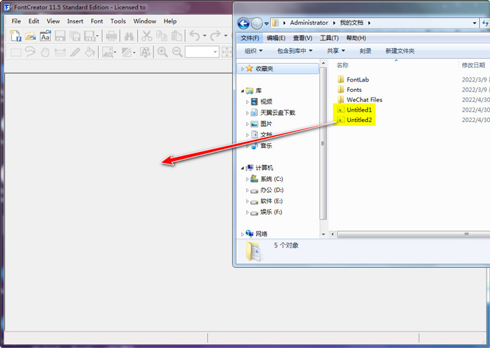
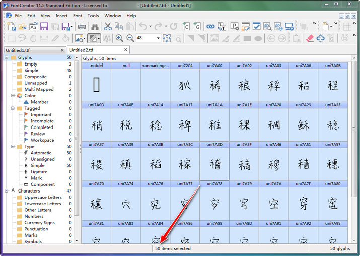
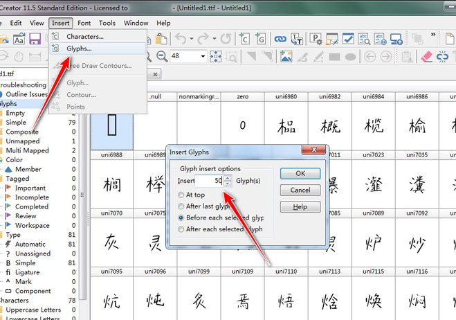
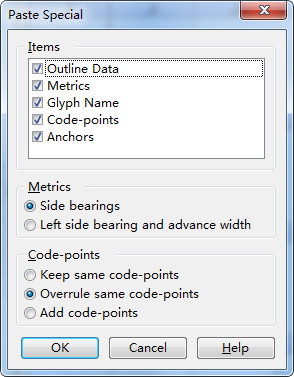
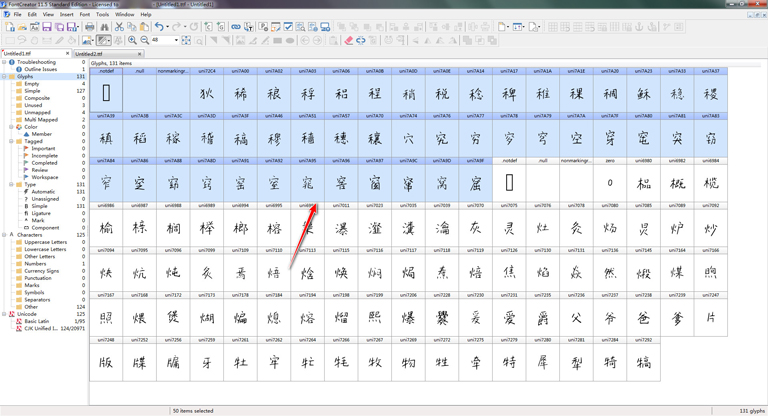
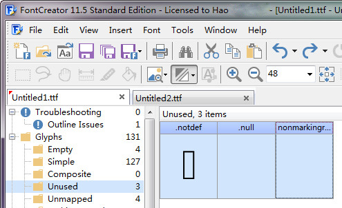
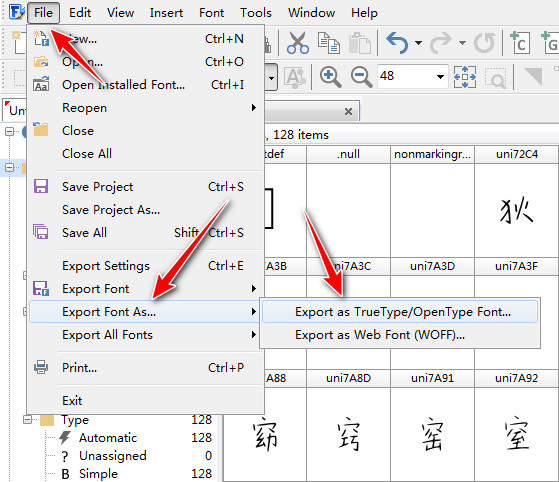
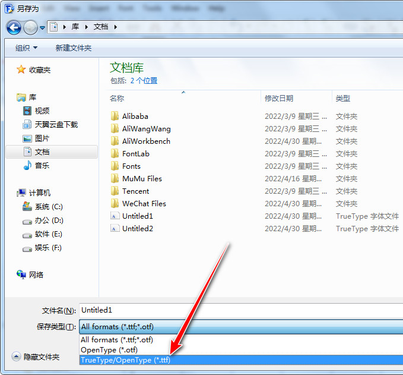

# 合并多个字体文件

```
本教程由做字体网（www.zuoziti.com）友情提供！
本教程是制作手写字体系列教程，建议从序言部分开始阅读学习！如需交流，请加QQ924268440
```

------

> ### **本节视频教程**

<iframe width="600" height="400" frameborder="0" src="https://www.ixigua.com/iframe/7159850189618938381?autoplay=0" referrerpolicy="unsafe-url" allowfullscreen></iframe>

> ### **合并多个字体文件**

　　前面我说过FontForge一次性导入太多的小图片会出现卡死的情况，我们最好是分批导入，这样就会生成好几个字体文件，我们需要把他们合并成一个文件。我们需要用到FontCreator了。  

1. 打开FontCreator直接把生成的所有字体文件拖进去。  
     
2. 我这边只生成了两个字体文件，我现在需要把字体2中的全部字形合并到字体1中。在字体2中按快捷键Ctrl+A全选，我们可以看到最下方状态栏中已经有50个字形被选中了，记下这个数字，然后按Ctrl+C复制。  
     
3. 切换到字体1中，点击菜单栏Insert→Glyphs（或者直接按快捷键按住Alt，依次按I，S），输入50，这样就插入了50个空白字形。  
     
4. 紧接着按快捷键Ctrl+Alt+V（三键同时按），点击OK。  
     
5. 这样就把字体2中的50个字形完完整整地复制并覆盖到字体1中的空白字形中了。  
     
6. 点击左侧工具栏Unused，我们发现有3个未使用的字形也就是重复的字形，删除掉即可。按快捷键Ctrl+A全选，然后按键盘上的Delete即可删除。或者按Ctrl+X也可以剪贴掉。  
     
7. 保存新字体。点击File→Export Font As→Export As TureType/OpenType Font（或者直接按住Alt，依次按F,E,E）。  
     
8. 这里下拉选择.ttf格式，或者直接在字体名字那边输入Untitled.ttf即可。  
     

> ### **下载本文相关软件**

　　本人是一个小白开发者，本人的原则是凡是网上能搜索到的软件本站一律不收费，只有本人原创的一些辅助小软件才酌情收费，本着量贩式的原则用到哪个下载哪个，当然你也可以用其他的一些软件去替代。开发软件很艰难、书写教程很辛苦，希望你能赏我一杯咖啡☕，多谢！  

**FontCreator官网下载地址（本文所用软件，官方收费挺贵）：**http://www.fontcreator.com/    
**FontCreator中文绿色破解版免费下载地址：**https://wwz.lanzouq.com/iUvdj05b8f4j 访问密码：htcw
