# 导入FontForge生成字体

```
本教程由做字体网（www.zuoziti.com）友情提供！
本教程是制作手写字体系列教程，建议从序言部分开始阅读学习！如需交流，请加QQ924268440
```

------

> ### **本节视频教程**

<iframe width="600" height="400" frameborder="0" src="https://www.ixigua.com/iframe/7159849676227740172?autoplay=0" referrerpolicy="unsafe-url" allowfullscreen></iframe>

> ### **FontForge导入步骤**

　　前面我们切割好了小图片，下面就要正式生成字体了。  

1. 先把小图片放进一个文件夹中，FontForge导入的小图片不要太多，太多容易卡死，我是分成四个文件夹，每个文件夹最多放置3000个左右。  
   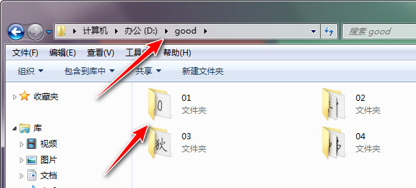  
2. 打开FontForge，点击New，新建一个文件。  
   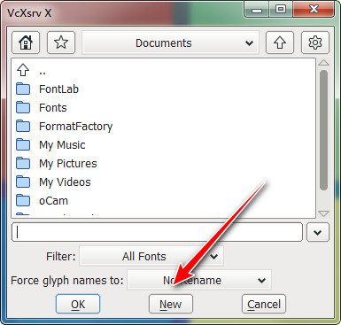  
3. 点击Encoding→Compact（或者直接按住Alt，注意是按住，然后依次按N，C，注意是依次），这一步是清空界面，方便查看。  
   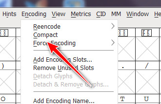  
4. 点击File→Execute Script，导入脚本。（或者直接按住Alt，然后依次按F，X）  
   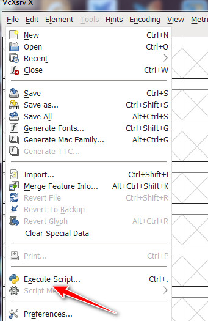  
5. 把我们的导入脚本内容复制进去（**脚本文件在本文末有下载**），**这里打开的TXT文件先不要关闭，要不然复制不进去，很奇怪，巨坑**。  
   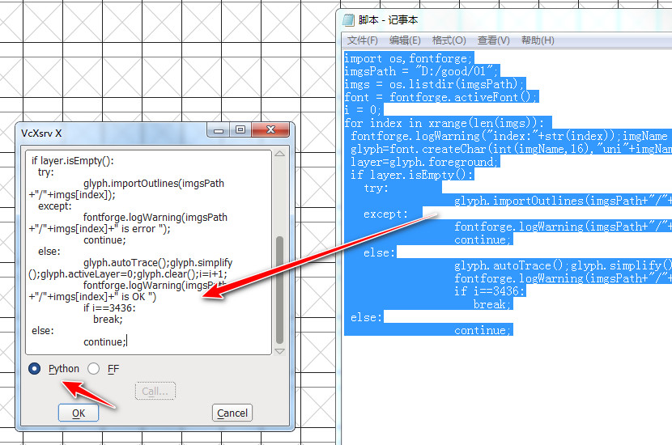  
6. 注意把这里的小图片存放路径改成你自己的哦，只需要改这一个地方，其他勿动。完成后点击OK。（或者直接按住Alt+O）  
   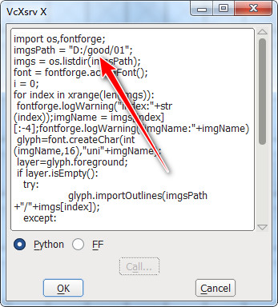  
7. 开始工作了，这里是滚动的导入记录。  
   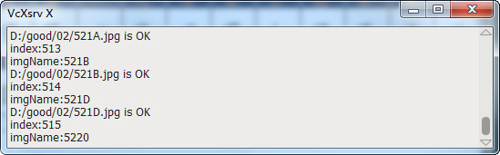  
8. 本批次所有小图片导入完，也可以继续导入其他目录下的小图片。这里没继续导入，演示的是导出字体文件。点击File→Generate Fonts。（或者直接按住Alt，然后依次按F，G）  
   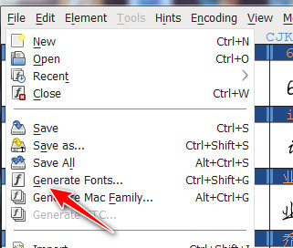  
9. 这里是默认保存位置，初始格式为PS type1（pfb），我们需要TrueType（ttf）。所以把格式改成TrueType，把Validate Before Saving前面的钩取掉，不需要验证，点击Generate保存文件。  
   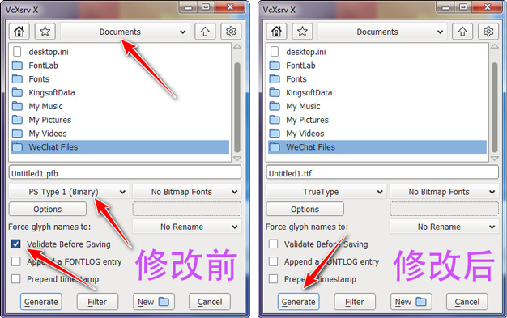  
10. 这里选择Yes默认即可。这样就导出了TTF字体文件了。  
    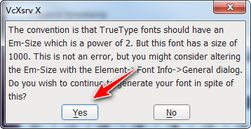  
11. 完成后就可以关闭软件了，选择保存还是不保存项目文件就看你了。我一般都是不保存，有字体文件了这个项目文件也没用了。  
    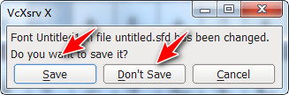  
12. 导出的字体文件默认保存位置在此。大功告成！  
    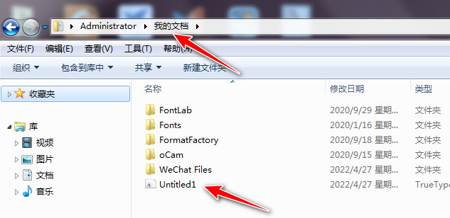  

> ### **下载本文相关软件及脚本**

　　本人是一个小白开发者，本人的原则是凡是网上能搜索到的软件本站一律不收费，只有本人原创的一些辅助小软件才酌情收费，本着量贩式的原则用到哪个下载哪个，当然你也可以用其他的一些软件去替代。开发软件很艰难、书写教程很辛苦，希望你能赏我一杯咖啡☕，多谢！  

**FontForge软件官网最新免费下载地址：**https://fontforge.org/en-US/  
**FontForge软件本站版本免费下载地址：**https://wwz.lanzouq.com/i3DjF05b7wwd 访问密码：6jb2  
**FontForge导入脚本下载地址：**https://www.xsoftnet.com/share/a000vzq24NPqH.html
