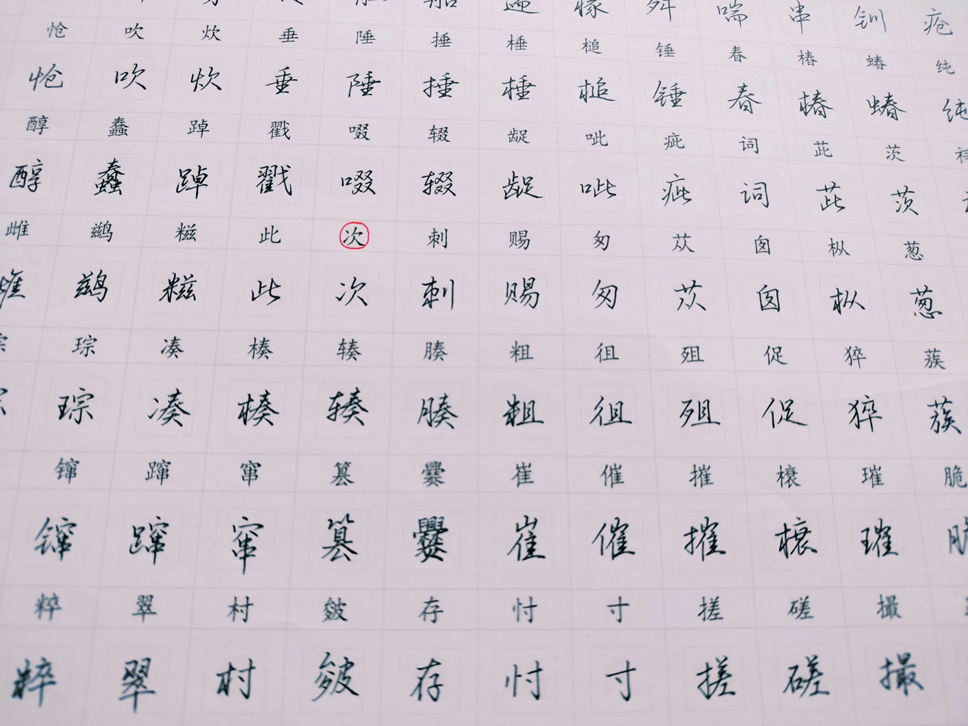
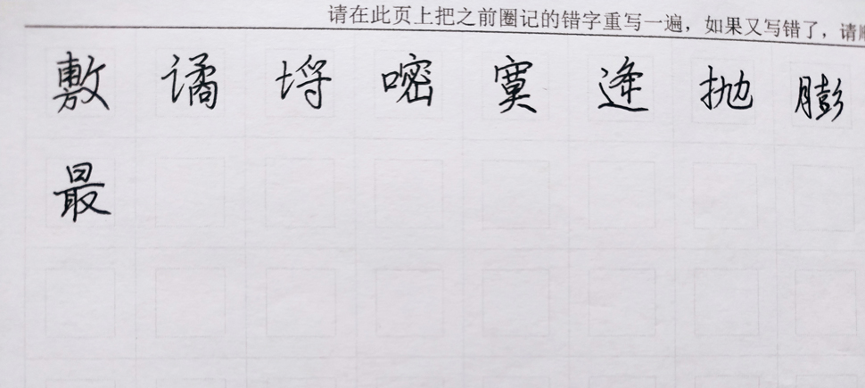
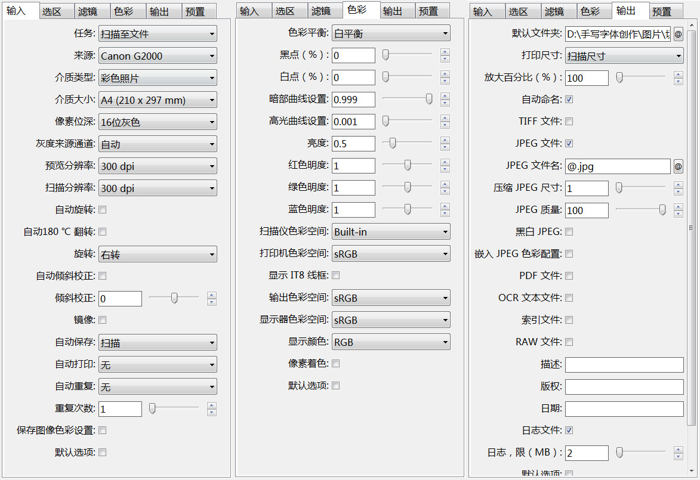
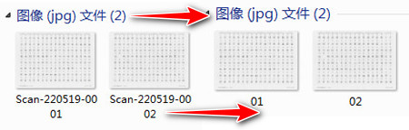
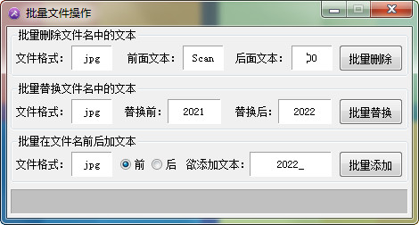

# 手写字稿扫描方法

```
本教程由做字体网（www.zuoziti.com）友情提供！
本教程是制作手写字体系列教程，建议从序言部分开始阅读学习！如需交流，请加QQ924268440
```

------

> ### **本节视频教程**

<iframe width="600" height="400" frameborder="0" src="https://www.ixigua.com/iframe/7159848780882248200?autoplay=0" referrerpolicy="unsafe-url" allowfullscreen></iframe>

> ### **写完的手写字稿是这样的**

　　前面我们设计好了手写模板，并选好了书写笔，剩下的就是工工整整地书写了，这个过程大约要一个月吧，写得快的也得两个星期，我们要保证质量，人不是机器，累了是需要休息的。

　　如上图所示，就这样认认真真地把字写在模板上，写错的或者写得不满意的就在模板上用红笔圈出来，注意不要圈记到其他字的书写区域。这样比较明显，方便在后面的错字模板上重写错字。

　　如上图所示，在错字模板上，把前面在正式书写模板上标记出来的错字，认认真真重写一遍。  
　　这样我们就把正式模板和错字模板全部写完了，下面我们开始扫描。

> ### **如何设置扫描参数达到最优**

**扫描软件**：扫描图片我用的是这个软件“**VueScan x64**”，这个软件网上有破解版，扫描图片非常的方便。此软件本文文末有提供下载。  
**扫描方法**：扫描分辨率我设置的是300DPI，这个数值大了肯定是清晰一些，但是扫描的速度会慢，得等待很长时间，分辨率大了并不会使得做好的字体效果更优。但如果小了的话会模糊，做成的字体效果会差一些。扫描的像素位深我选择的是16位灰度。这也是我经过大量的实验得出的最优位深，如果是黑白对比度大的话，做出的字体毛刺比较多。下面是我的部分扫描参数设置，大家可以参考一下。  


> ### **扫描的图片重命名**

　　扫描完图片后文件名比较复杂比如“Scan-220519-0001.jpg”，最好再重命名一下，简单点比较好，比如重命名为“01.jpg”。  
  
　　手动或者用软件都可以实现。我这边自己设计了一款批量重命名软件，**批量文件操作**，需要的在本文末下载。  


> ### **下载本文相关软件**

　　本人是一个小白开发者，本人的原则是凡是网上能搜索到的软件本站一律不收费，只有本人原创的一些辅助小软件才酌情收费，本着量贩式的原则用到哪个下载哪个，当然你也可以用其他的一些软件去替代。开发软件很艰难、书写教程很辛苦，希望你能赏我一杯咖啡☕，多谢！  

**VueScan Pro 9.4.19免费下载地址：**https://wwz.lanzouq.com/izzMY051vhxi 访问密码：1bjc  
**批量文件操作下载地址：**https://www.xsoftnet.com/share/a000vcqbFd0Ga.html  
