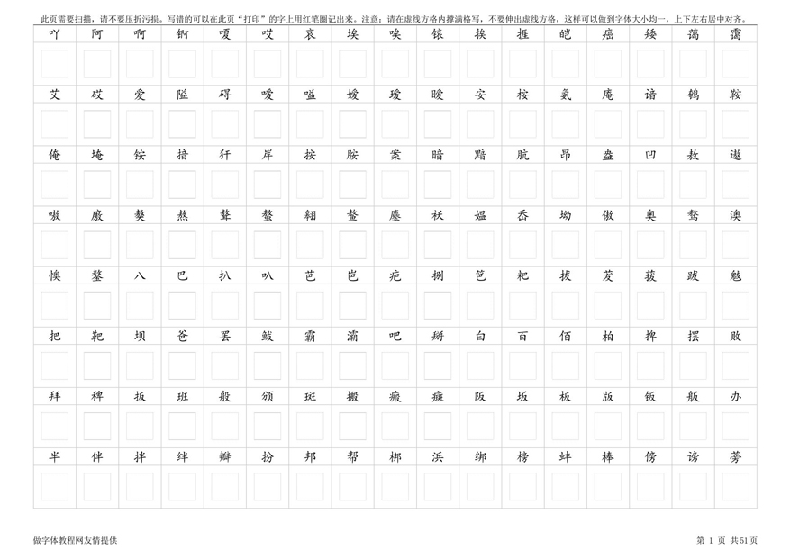
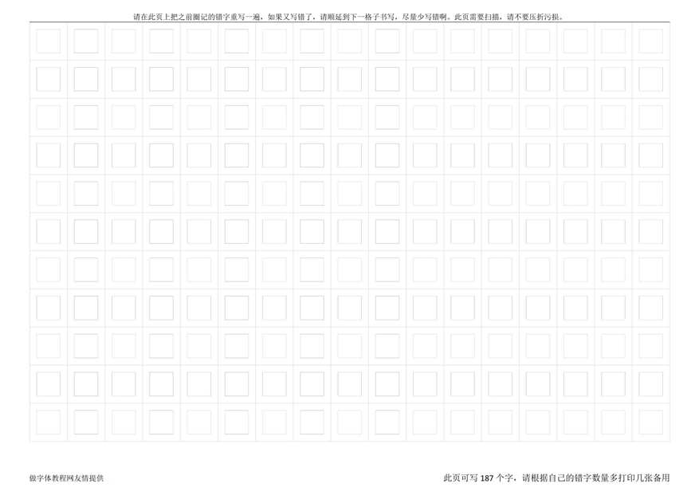

# 手写模板的设计

```
本教程由做字体网（www.zuoziti.com）友情提供！
本教程是制作手写字体系列教程，建议从序言部分开始阅读学习！如需交流，请加QQ924268440
```

------

> ### **本节视频教程**

<iframe width="600" height="400" frameborder="0" src="https://www.ixigua.com/iframe/7159847786094002720?autoplay=0" referrerpolicy="unsafe-url" allowfullscreen></iframe>

> ### **先看一下模板样子**

　　从这一节我们正式开始制作手写字体，制作手写字体的第一步就是制作手写字体模板，先看一下我的模板样子。

　　友情提示：此页需要扫描，请不要压折污损。写错的可以在此页“打印”的字上用红笔圈记出来。注意：请在虚线方格内撑满格写，不要伸出虚线方格，这样可以做到字体大小均一，上下左右居中对齐。

> ### **如何设计正式书写模板**

１．**设计原则：**  
　　我们做一套最简单的简体GB2312标准的字体，就得需要书写6763个字符，所以在设计模板时要尽量做到紧凑以便节省打印纸张。**不要小瞧这个6763字，我打印了51页A4纸哦**，同时还要设计的便于对照，避免在书写时出现大量的错别字、错位字。  
２．**实践出真知：**  
　　经过大量实验，我发现手写模板的格子最好是1cmX1cm的，这样对于大多数人来说用硬笔书写是比较合适的，太大太小都会让人感觉很别扭。当然你要是想着用毛笔书写设计的话肯定得把这个设计的大一些。上面就是我设计的自我感觉比较合理的模板，中间有个虚线格子可以约束字形大小，防止做出的字体字形有大有小的不均匀，看着别扭。上方有汉字，方便对照，防止写串行，以免给后面的制作工作造成巨大麻烦。  
　　另外格子外边框及对照的汉字都是黑色的，但是最里面的1cmX1cm的格子必须是灰色的，这一点很重要。导入图片生成字体的时候灰色是被忽略的而黑色则不能！

> ### **关于错字模板的设计**


`请在此页上把之前圈记的错字重写一遍，如果又写错了，请顺延到下一格子书写，尽量少写错啊。此页需要扫描，请不要压折污损。`  
　　如上图所示，这里都是空白格子，没有提示的汉字。这样方便根据前面正式书写模板的错误标记重写错字。

> ### **手写模板的打印要求**

　　一定注意，一定注意，一定注意！重要的事情说三遍！我们手写需要用到**灰色格子**，大家最好要用**彩色喷墨打印机**打印，它可以打印出灰色格子。而黑白激光打印机打印出的全是黑色的，导入图片生成字体的时候黑色边框会被识别成字体的一部分！也可以试试彩色激光打印机，我这边没有这个机器没有试试，估计颗粒感会很强。

> ### **免费下载手写模板**

　　你可以免费下载使用我设计好的模板，可以省下很多不必要的麻烦。此文件包含设计好的手写模板，可以直接打印。另外还有一个TXT字序文件，方便需要增加汉字的同学增加汉字使用。（注意如果要增加汉字，那么增加汉字必须在DOC模板和TXT字序文件中一一对应，必须的！）  
**做字体网标准模板V4.0下载地址：**https://wwz.lanzouv.com/iSYMd0cnh5ng 访问密码：aa0i
