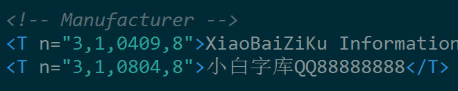
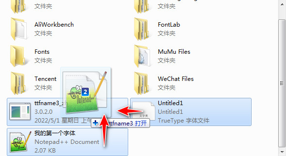
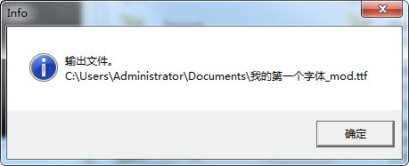
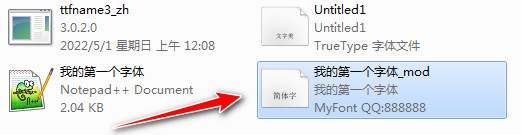
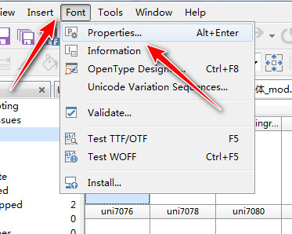
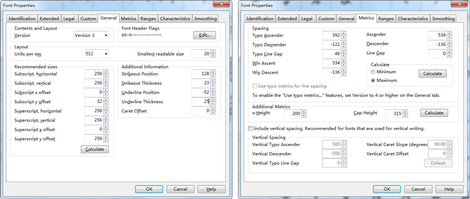
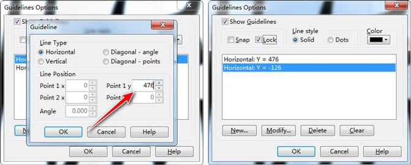
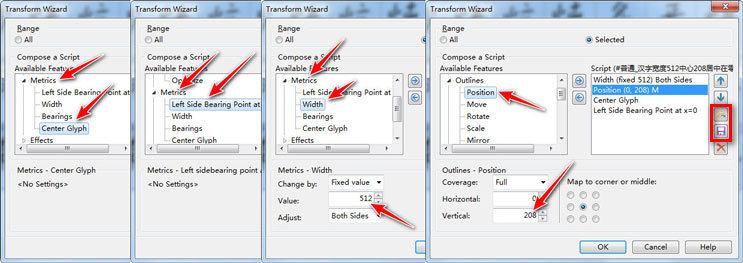
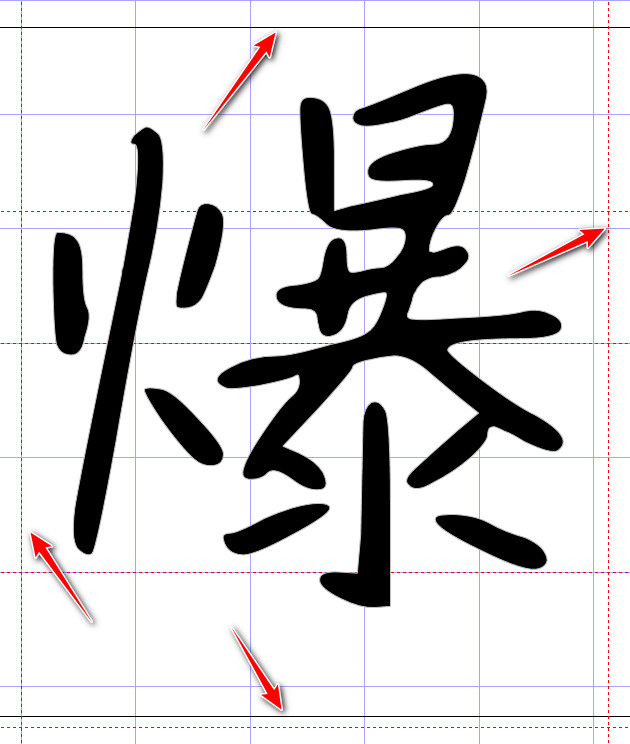
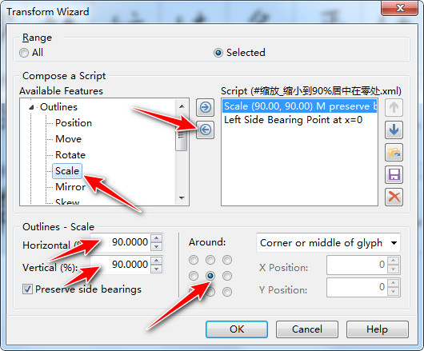

# 调整字体参数

```
本教程由做字体网（www.zuoziti.com）友情提供！
本教程是制作手写字体系列教程，建议从序言部分开始阅读学习！如需交流，请加QQ924268440
```

------

> ### **本节视频教程**

<iframe width="600" height="400" frameborder="0" src="https://www.ixigua.com/iframe/7159850514358731300?autoplay=0" referrerpolicy="unsafe-url" allowfullscreen></iframe>

> ### **导入厂商信息等固定参数**

　　前面我们已经生成了字体，但是我们还想把字体做的更个性化一些。一些字体参数，比如字体名、版本信息、厂家信息、制作时间、上伸下伸数据等等的你都可以自定义，作为统一的字体家族信息使用。我是保存为一个XML文件，方便下次使用。（此XML文件文末有下载）此文件包含两部分Header和Name，Header部分保持原样即可，Name部分文本内容如下，你可以随便修改里面的数据。比如给自己的字体起名为“我的第一个字体”，把我的字库名定义为“小白字库”，加上我的联系信息、网站信息等等的都可以。

`

```
<!-- Copyright -->
<T n="3,1,0409,0">(c) Copyright XiaoBaiZiKu Information Technology Co.</T>
<T n="3,1,0804,0">(c) Copyright XiaoBaiZiKu Information Technology Co.</T>

<!-- Family -->
<T n="3,1,0409,1">WDDYGZT</T>
<T n="3,1,0804,1">我的第一个字体</T>

<!-- Subfamily -->
<T n="3,1,0409,2">Regular</T>
<T n="3,1,0804,2">Regular</T>

<!-- UniqueIdentifier -->
<T n="3,1,0409,3">WDDYGZT:Version 1.00</T>
<T n="3,1,0804,3">WDDYGZT:Version 1.00</T>

<!-- FullName -->
<T n="3,1,0409,4">WDDYGZT</T>
<T n="3,1,0804,4">我的第一个字体</T>

<!-- Version -->
<T n="3,1,0409,5">Version 1.00</T>
<T n="3,1,0804,5">Version 1.00</T>

<!-- PostscriptName -->
<T n="3,1,0409,6">WDDYGZT</T>
<T n="3,1,0804,6">WDDYGZT</T>

<!-- Trademark -->
<T n="3,1,0409,7">Trademark of XiaoBaiZiKu</T>
<T n="3,1,0804,7">Trademark of XiaoBaiZiKu</T>

<!-- Manufacturer -->
<T n="3,1,0409,8">XiaoBaiZiKu Information Technology Co.</T>
<T n="3,1,0804,8">小白字库QQ88888888</T>

<!-- Designer -->
<T n="3,1,0409,9">XiaoBaiZiKu</T>

<!-- Description -->
<T n="3,1,0409,10">This is an elegant font!</T>

<!-- VendorURL -->
<T n="3,1,0409,11">http://www.zuoziti.com</T>
<T n="3,1,0804,11">http://www.zuoziti.com</T>

<!-- DesignerURL -->
<T n="3,1,0409,12">http://www.zuoziti.com</T>
<T n="3,1,0804,12">http://www.zuoziti.com</T>

<!-- LicenseDescription -->
<T n="3,1,0409,13">Business is prohibited without permission!</T>
<T n="3,1,0804,13">未经许可，禁止商用！</T>

<!-- LicenseInfo -->
<T n="3,1,0409,14">http://www.zuoziti.com/</T>
```

`

1. 修改完XML文件之后，选中字体文件和XML文件，然后把这个两个文件一起拖到**ttfname3_zh.exe**的图标上松开即可。  
     
2. 点击确定。    
     
3. 固定参数已经导入进字体文件中，并且新字体已经保存。  
     

> ### **在FontCreator中继续调整个性化参数**

　　上面仅仅是把厂商信息等等的导入进去了，涉及到字体的一些参数还没有进行修改，下面我们用FontCreator来修改。  

1. 把新字体拖进FontCreator界面中打开。点击菜单栏Font→Properties（或者直接按快捷键Alt+Enter）。  
     
2. 打开的窗口中有两个重要的地方需要修改，General和Metrics这两个可按照我的参数值修改，其他的选项卡可酌情修改。  
     
3. 上面两个参数设置完了你会发现字形变的非常大，这时候我们还需要设置字形宽度、大小及字形居中等。我们先来设置下参考线，随便打开一个字形，按住键盘上的Alt，然后依次按L，L，N，如下图。Point 1 y处设置476，再点击New，设置一个-126的值（注意是负值哦）。最后Lock上别忘记打钩。  
     
4. 回到主界面，按快捷键Ctrl+A全部选中字形，接着再按住Alt，依次按L，T，在跳出的对话框中分别选择左侧的参数项设置如下值，比较多大家一定要耐心点。这四行代码的意思分别是，宽度设置为512，重心在208，字形居中，最左边在零处。全部设置完后点OK进行变换。**聪明的你也已经发现了，此时的界面上有打开和保存两个按钮（图中红框部分）。你可以把这么多繁琐的设置参数保存为文件，下次直接打开载入这个文件即可，就不用这样一个一个的添加了。（参数配置文件文末有下载，可以直接用我的。）**  
     
5. 我们随便点击一个字形检查一下，看看字形是不是都在参考线以内，如图，“爆”的字形已经完美约束在参考线内了。  
     
6. 基于这个参考线，如果字形过大或者过小都是不行的，需要进行缩放。要不然做出的字体要么过大被切头切脚要么就很小。比如说你要缩小某几个字形，那么步骤是这样的，按住Ctrl键的同时用鼠标左键点选你需要缩小的字形，保持选中的状态接着再按住Alt，依次按L，T，弹出步骤4中的窗口，先点击左箭头把前面设置的参数全部清除掉。再点击Outlines下面的Scale参数项，设置水平90，垂直90，选中中心点，意思就是基于字形的中心点宽高分别缩小到原先的90%。缩小完你会发现字形的宽度什么的变了，不要紧，只要再按照步骤4重新设置下宽度居中等等的就可以了。  
     

> ### **下载本文相关软件及参数配置文件**

　　本人是一个小白开发者，本人的原则是凡是网上能搜索到的软件本站一律不收费，只有本人原创的一些辅助小软件才酌情收费，本着量贩式的原则用到哪个下载哪个，当然你也可以用其他的一些软件去替代。开发软件很艰难、书写教程很辛苦，希望你能赏我一杯咖啡☕，多谢！  

**ttfname3_zh免费下载地址：**https://wwz.lanzouq.com/iTfER05bkfli 访问密码：52z6  
**厂商信息等固定参数下载地址：**https://www.xsoftnet.com/share/a000w00mAgjjU.html  
**转换向导各种参数免费下载地址：**https://wwz.lanzouq.com/iFEvG05bll8h 访问密码：2udt
