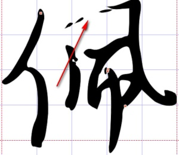
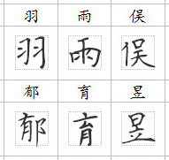
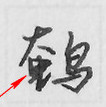
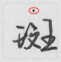
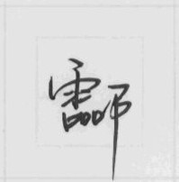

# 选笔与书写要求

```
本教程由做字体网（www.zuoziti.com）友情提供！
本教程是制作手写字体系列教程，建议从序言部分开始阅读学习！如需交流，请加QQ924268440
```

------

> ### **本节视频教程**

<iframe width="600" height="400" frameborder="0" src="https://www.ixigua.com/iframe/7159848354757739019?autoplay=0" referrerpolicy="unsafe-url" allowfullscreen></iframe>

> ### **工欲善其事，必先利其器**

　　前面我们已经设计好了书写模板，我们打印出来就可以开始书写了。但是为了让准备工作做的更加充分，我们还需要对笔和手有一些要求，要求如下。

> ### **选笔要求**

- **1、墨水颜色**：必须选用黑色的，其他的颜色与白纸的色差弱，机器识别困难，生成字体效果差。  
- **2、粗细**：建议使用0.7毫米粗细的，最好是中性笔，太细的会出现笔画中断现象，太粗的又会挤成一团，黑压压的。  
- **3、圆滑度**：有的钢笔书写时由于出墨不均匀导致颜色深浅不一，会使生成的字体笔画有毛刺甚至笔画中断。如右图所示笔画出现中断了，所以尽量选用油量大且出水均匀的中性笔吧，钢笔一定不能洇纸！  
  
- **4、换笔**：中途不要再换其他类型的笔，否则会导致字形笔画粗细及颜色深浅不一致，生成的字体后期处理是很费劲的，用一种类型的笔一气呵成最好了。  

> ### **书写要求**

- **1、整体要求**：字形要大小均一、上下左右居中对齐，以刚刚触碰到里面的虚线格子即撑满格写为宜，不要超出虚线格子，虚线格子是约束字形大小的，这样可以保证大部分字形大小均一。（如“日”“一”“小”等字本身就需要写的小一些的，顶格就有些难看了，所以顶格写并不是绝对的，除了这些特殊的字，其他字最好顶格写，自己把握吧。）如右图这样撑满格写就可以了。  
  
- **2、英文**：请按照英文“四线三格”规范书写，忘记怎么写的可以百度一下“四线三格手写”。  
- **3、错字**：写错了或者写的不满意的，请用红笔在打印的字上圈记出来，圈记的明显些，方便以后识别。不要圈记到其他字的书写区域，全部书写完了再统一在最后的错字空白模板上重写错字即可。尽量少写错，最好一遍成功，要不然工作量就增大了。  
- **4、笔画粘连及多余点**：不要在书写区域出现多余的点，否则多余的点会被识别成字形的一部分。也不要让笔画挨得很近眯成一团。如下图所示。  
  
- **5、简繁体**：有些人是有强迫症的，看着简繁体掺和在一起就很难受，所以请按照模板上的文字书写，该简就简该繁就繁。另外，一些不容易被大众识别的特殊写法也不要出现。  
- **6、长腿字**：如图所示最后一笔已经明显超出虚线格子了，这种长腿字是很不适合做字体的，请不要出现这种长腿字！  
  
- **7、疲劳**：写累了就休息一会，不要前面认真后面潦草，这样的字体前后风格不一样是很难看的。  
