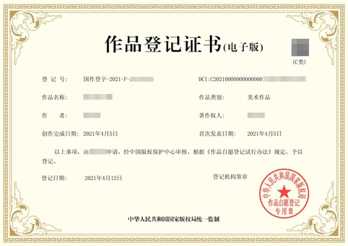
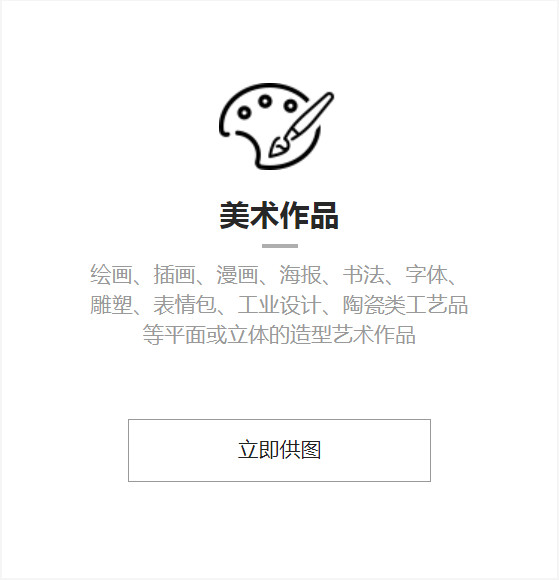
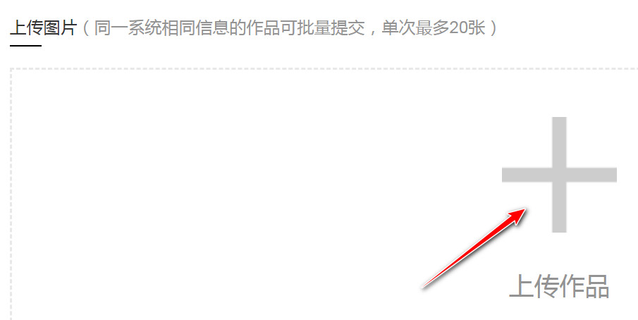
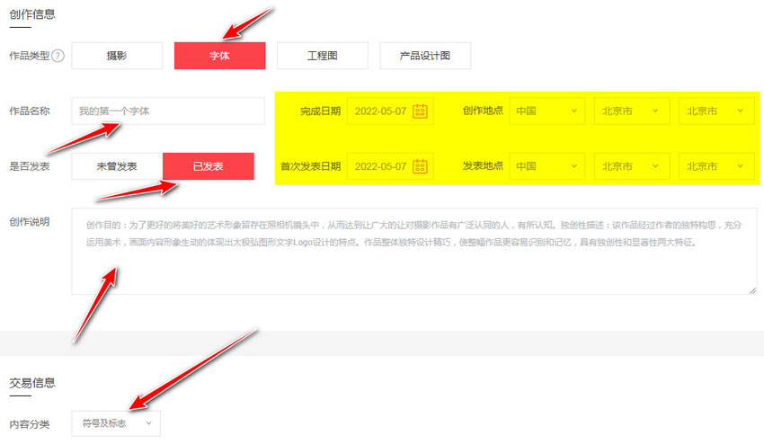

# DCI数字版权登记

```
本教程由做字体网（www.zuoziti.com）友情提供！
本教程是制作手写字体系列教程，建议从序言部分开始阅读学习！如需交流，请加QQ924268440
```

------

> ### **本节视频教程**

<iframe width="600" height="400" frameborder="0" src="https://www.ixigua.com/iframe/7159859856768238083?autoplay=0" referrerpolicy="unsafe-url" allowfullscreen></iframe>

> ### **什么是DCI数字版权**

  
　　DCI（Digital Copyright Identifier，数字版权唯一标识符），中文名称“数字版权唯一标识符”，用于标识和描述数字网络环境下权利人与作品之间一一对应的版权权属关系。  
　　我的理解是，上一节讲的区块链存证是民间的，是区块链公司颁发的；而DCI数字版权是官方的正式的，是国家版权局颁发的。两者都有法律效力，DCI数字版权效力更高一些吧，而在具体的举证中区块链存证则有更直观强大的举证能力。  

> ### **如何免费获得DCI数字版权证书**

　　DCI数字版权可以直接去国家、各省市的版权局登记，应该是收费的，很早的时候申请过一次，100元一件，现在多少钱就不清楚了。出证时间都很慢，少则一星期多则一个月才能出证吧，可能连纸质证书一起出来。  
　　网上也有一些第三方登记机构直接对接的国家版权局，这个途径最好了，有收费的也有免费的。我找到一个最好的[**美素版权**](http://www.meisubq.com/)，完全免费，超赞！关于注册认证之类的本站就不罗嗦了，自行解决吧，我为大家具体讲讲如何免费登记。  

1. 登录[**美素版权**](http://www.meisubq.com/)，点击顶部导航栏“**版权服务**”，然后在页面中选择美术作品，点击“**立即供图**”。  
     
2. 点击大大的加号上传图片。图片格式仅限JPG、PNG，不低于400万像素，最大20M。  
     
3. 杂项设置。作品类型选择“**字体**”；作品名称会根据所上传的图片名**自动填写**，一般不用管；不管字体发表不发表的一律写**已发表**，只有发表了才有版权登记的必要吧，没有发表自己存着还登记什么呢？完成时间和首次发表时间自己大胆填写即可。创作说明这个要重点写啊，写的不好要被打回的。**你要把你的字体独特之处写出来，越与众不同越能突出个性越好，字数大约300字足够了**。内容分类选择“**符号及标志**”。  
     
4. 提交之后剩下的就是苦等了，快的时候一个星期出结果，慢的时候可能得半月二十天了。可以在自己手机上设置一个日程，提醒自己去看看有没有出结果，别忘记了。
