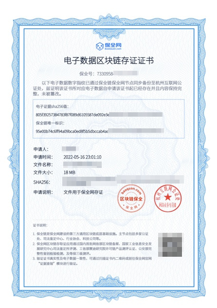
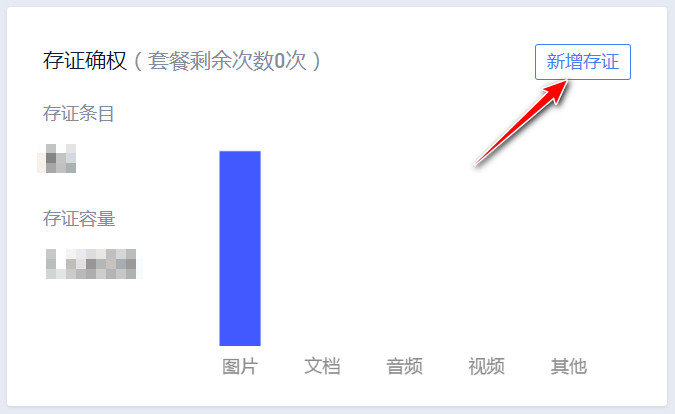
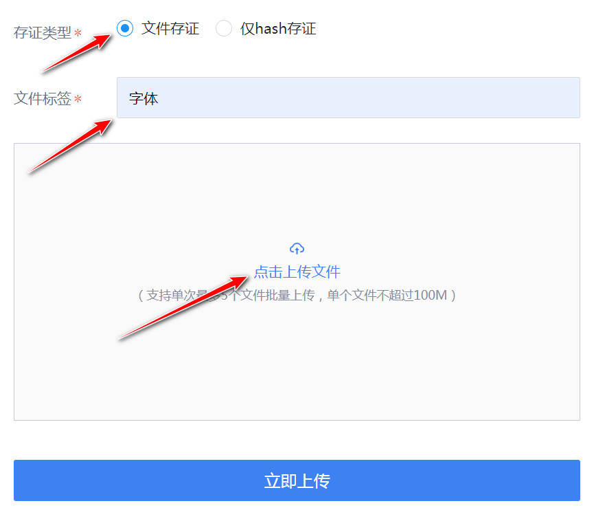
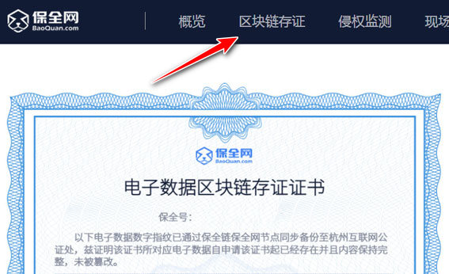

# 区块链存证

```
本教程由做字体网（www.zuoziti.com）友情提供！
本教程是制作手写字体系列教程，建议从序言部分开始阅读学习！如需交流，请加QQ924268440
```

------

> ### **本节视频教程**

<iframe width="600" height="400" frameborder="0" src="https://www.ixigua.com/iframe/7159859534297891332?autoplay=0" referrerpolicy="unsafe-url" allowfullscreen></iframe>

> ### **什么是区块链存证**

  
　　区块链存证就是将作品信息加密生成独一无二的DNA数字指纹，并基于区块链和电子签章技术，将存证文件hash值、上传者身份信、上传时间等信息一同记录到区块链中，为原创作品赋予不可篡改的数字身份。  
　　上面说的比较专业，我的理解其实就是把你的手写字体文件及各种原创信息上传到区块链中，一旦上链，谁也无法篡改！这样就能证明你是原创者！  

> ### **如何免费获得区块链存证证书**

　　目前，国内外区块链技术正在蓬勃发展，有很多区块链的发展方向是版权存证，百度一下有好多，这个我推荐一个[**保全网**](https://new.baoquan.com)。这个网注册之后会获得100个保全币，一个保全币就可以登记一个区块链存证。也就是说我们可以有100个免费名额，这对于我们小白来说足够了。网站的注册认证什么的，这里就不去详细介绍了，大家自行完成即可。下面是存证方面的步骤：  

1. 网站登录进去之后，点击右上角用户名处进入个人中心。点击“**新增存证**”。  
     
2. 存证类型选“**文件存证**”，文件标签这个自己随便写，方便区分用的，我写的是字体。点击上传字体的图片文件（在第二章第一节中有介绍如何获取这个图片文件）  
     
3. 稍等5秒钟，点击网站导航栏“**区块链存证**”即可看到我的全部存证，点击“**查看**”，把存证证书保存下来即可。  
   
