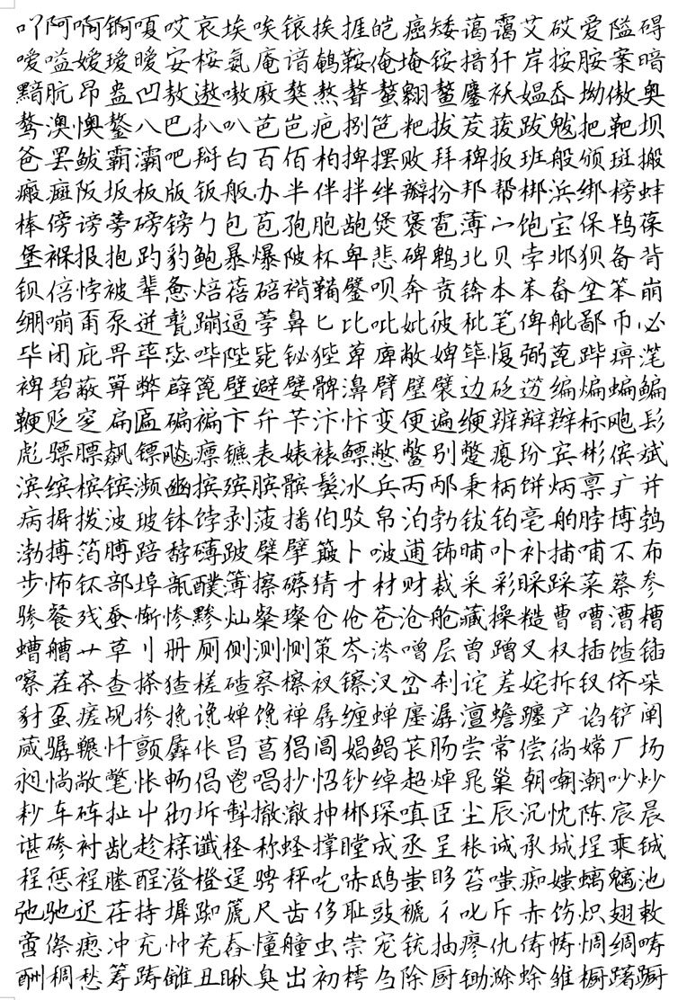
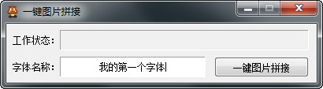

# 获取手写字体的全部字形图片

```
本教程由做字体网（www.zuoziti.com）友情提供！
本教程是制作手写字体系列教程，建议从序言部分开始阅读学习！如需交流，请加QQ924268440
```

------

> ### **本节视频教程**

<iframe width="600" height="400" frameborder="0" src="https://www.ixigua.com/iframe/7159859109423284740?autoplay=0" referrerpolicy="unsafe-url" allowfullscreen></iframe>

> ### **版权登记前的准备**

　　手写字体版权登记的类别属于美术作品类，有些登记网站会在美术类别下面细分为字体类别。所以我们在登记版权前就需要先把我们的手写字体中全部字形呈现出来。下面我介绍两种方法获取这些图片。  

> ### **手工获取全部字形的图片**

  
　　如上图所示，我们在登记版权之前需要把字体中所有字的外形呈现在一张图片上，你可以用WORD展示所有字形再用滚动截屏软件保存为一张长图片。  

> ### **自动获取全部字形的图片**

　　最初的时候我就是用上面的方法搞的，但是后来发现这样也是很慢的，很费功夫。并且版权登记的时候要求图片的长边小于30000像素，手工生成的图片长度有时候会超过这个要求，就得手工再去修改长度。  
　　所以我就做了一个自动生成全部字形图片的小工具“**一键图片拼接**”，看下图。只要输入一个字体名就可以把这个字体中所有字形一起输出为一个符合版权登记的长图片。  
  

> ### **下载本文相关软件**

　　本人是一个小白开发者，本人的原则是凡是网上能搜索到的软件本站一律不收费，只有本人原创的一些辅助小软件才酌情收费，本着量贩式的原则用到哪个下载哪个，当然你也可以用其他的一些软件去替代。开发软件很艰难、书写教程很辛苦，希望你能赏我一杯咖啡☕，多谢！  

**一键图片拼接下载地址：**https://www.xsoftnet.com/share/a000w05b6Ysdh.html  
