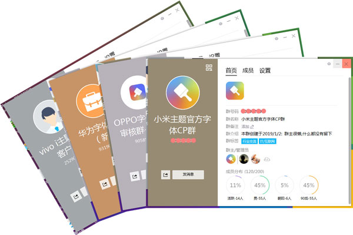

# 如何出售手写字体

```
本教程由做字体网（www.zuoziti.com）友情提供！
本教程是制作手写字体系列教程，建议从序言部分开始阅读学习！如需交流，请加QQ924268440
```

------

> ### **本节视频教程**

<iframe width="600" height="400" frameborder="0" src="https://www.ixigua.com/iframe/7159860233186214441?autoplay=0" referrerpolicy="unsafe-url" allowfullscreen></iframe>

> ### **销售渠道有哪些**

　　目前允许以个人名义参与的字体销售平台有小米、字客网、找字网等等，其他的如华为、VIVO、OPPO、魅族、字体超市等则需要以企业身份进行合作。  
　　合作分成一般是三七分，即平台占三3成，我们占7成。也有的平台是五五分成。一般一款字体标价6元，除掉渠道成本费、税费后能赚到三元多点，别小看这三块钱，他们这些平台自带超大流量，销售还是很不错的。  
　　下面是常用字体销售平台的网址，大家可以有选择地进行合作。  

- [华为主题联盟](https://developer.huawei.com/)
- [OPPO开放平台](https://open.oppomobile.com/)
- [VIVO设计师平台](https://designer.vivo.com.cn/)
- [MIUI主题设计师](https://zhuti.designer.xiaomi.com/)
- [魅族开发者中心](http://designer.meizu.com/)
- [站长素材](http://www.chinaz.com/)
- [字客网](https://www.fontke.com/)
- [找字网](http://www.zhaozi.cn/)
- [字体超市](https://www.font.cn/)

> ### **杀手锏：直接对接各字体销售平台商务联系人员**

    
　　**下面下载地址中的联系信息就是各个平台商务对接人员的QQ、电话、邮箱等联系方式，一手渠道信息，资料贵重，价格小贵！（大白菜和海参同样可以充饥，但价格天壤之别，就是这个道理！）这是你开启成功大门的钥匙！这是你开启成功大门的钥匙！这是你开启成功大门的钥匙！重要的事情说三遍不过分吧？！收集不易，资料小贵，谢谢打赏！**

**各平台商务人员联系方式、QQ群：**https://www.xsoftnet.com/share/a000w08Qi1Qma.html
