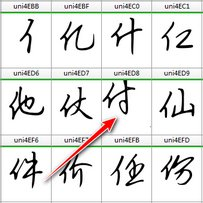
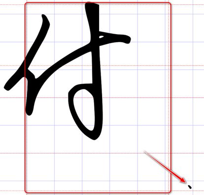
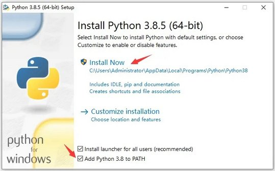
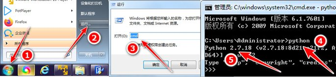
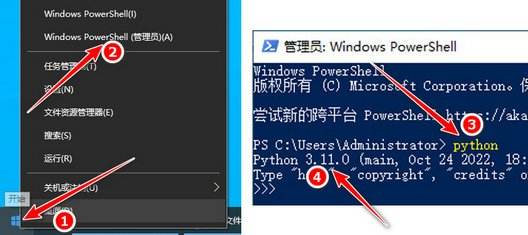
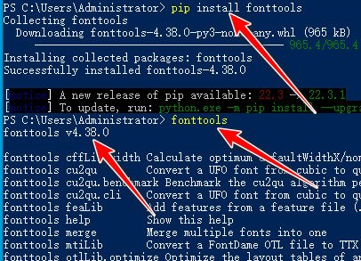
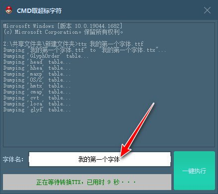
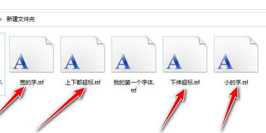

# 批量筛选超标字符

```
本教程由做字体网（www.zuoziti.com）友情提供！
本教程是制作手写字体系列教程，建议从序言部分开始阅读学习！如需交流，请加QQ924268440
```

------

> ### **字形中含有杂点是怎么产生的**

　　前面经历了一路的坎坷，我们终于做好了自己人生中第一款字体。但是我们发现，无论我们怎样认真，仍然会有疏漏，比如下图中这样的杂点。  
　　   
　　在fontcreator中，我们发现这个“付”字字形并没有居中，它处在偏上偏左的位置。我们打开看看具体是什么原因。  
　　   
　　原来是在这个字的右下方有一个杂点，这是因为我们在书写时不小心弄上了一个黑点，或者说是扫描的时候沾上了一些杂质。这样软件在导入的时候，就把这个小点也当成了字形的一部分，就把字形的主体部分顶到左上方了。从图上可以看出，字形主体部分已经超出了上图方框中的安全区域，这是不允许的。我们前面之所以让大家用灰度扫描，就是因为这个灰度模式可以把大部分杂质点都忽略掉，但是有一些颜色特别深的，却不能忽略掉。那我们现在需要做的就是把这些含有杂点的字形挨个找出来统一处理。如果用眼去找的话，确实比较麻烦，这里我提供了自动化工具，大家可以有选择的使用。  

> ### **CMD批量取超标字符**

　　我写的这个自动化工具是要借助python和fonttools这两个免费工具。我们得先安装它们。  
**第一步，安装python。**文末有免费下载地址。win7支持的最高版本可能是3.8，我这边用的例子是3.11。这里大家可以根据自己的系统去选择对应的版本。在安装的时候注意安装步骤底部这个“Add Python xxx to PASH”要打勾即添加环境变量。  
　　   
　　安装完以后我们验证一下是不是已经安装好了。具体的方法是这样的，win7系统→开始→运行→输入cmd→输入python，之后出现版本信息即表示安装成功。如下图所示。  
　　   
　　如果是win10系统，稍有些差别。win10系统→右键开始（注意是右键）→Windows PowerShell（管理员）→输入python，之后出现版本信息即表示安装成功。如下图所示。  
　　  
**第二步，安装fonttools。**用上面的方法打开cmd或Windows PowerShell窗口，执行一下安装命令（复制进去回车即可)。  

```
pip install fonttools
```
　　很快就可以安装完成了，我们再执行一下命令看一下是否安装成功。直接在窗口中输入“fonttools”（不含引号），返回版本信息就是表示成功的。  
　　    
**第三步，打开我的自动化工具“CMD批量取超标字符”。**<font color="red">注意这个工具只适用于用前面教程中的字体参数导出的字体，如果你是用其他参数做的字体，那我这个工具是不能用的！</font>字体和软件要放在同一目录下，然后输入字体名，不要输入其他符号和空格，点击“一键执行”，稍等片刻软件就会把字体中超出标准的字形取出了。  
　　  
　　取出的超标字符是这样的，如下图所示。后续我们只需要单独处理这些上下超标、上伸超标、下伸超标、较宽或者较小的字，比如经过放大、缩小、加粗、减瘦等等的操作，这样基本上就可以把字形调整的比较统一了，处理完后再把他们替换到原字体中即可。  
　　    

> ### **下载本文相关软件**

　　本人是一个小白开发者，本人的原则是凡是网上能搜索到的软件本站一律不收费，只有本人原创的一些辅助小软件才酌情收费，本着量贩式的原则用到哪个下载哪个，当然你也可以用其他的一些软件去替代。开发软件很艰难、书写教程很辛苦，希望你能赏我一杯咖啡☕，多谢！  

**python免费下载地址：**https://wwno.lanzouf.com/b018c01xg 密码:fcrl  
**CMD批量取超标字符下载地址：**https://www.xsoftnet.com/share/a000f4KcjMcW1.html     